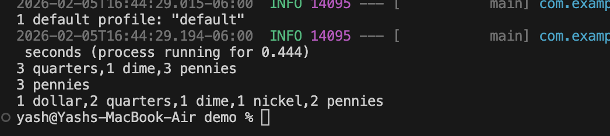
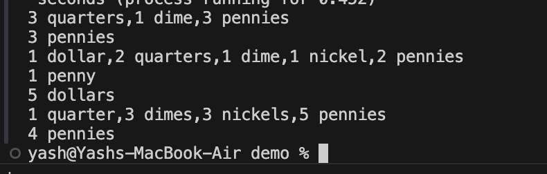
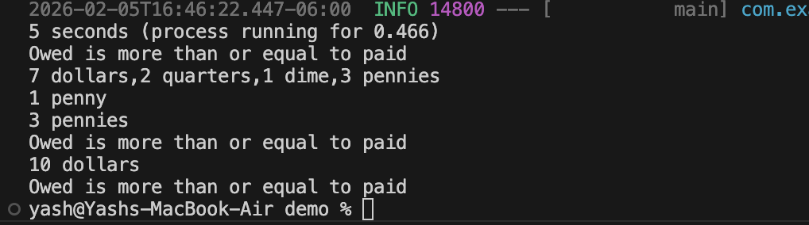

# Cash Register
A Java Spring Boot application for implementing Cash Register Service.

## Solution
CashRegisterApplication
- Greedy Algorithm is used for calculating minimum amount of physical change
- For implementing the random twist, the denominations are chosen at random
	- The random divisor in application.yaml is 3 - the number that the "owed" amount should be divisible by.
- If client needs to another special case, the client must do the following-
	- Add a rule such as TestRule.java implementing the ChangeRule.java Eg- MinimumChangeRule.java and RandomDivisorRule.java 
- If a client needs to another currency, the client must do the following-
	- Add a currency such as TestCurrency.java, implementing the Currency.java interface. Eg - USCurrency.java, FranceCurrency.java

## Implementation features
- Multithreading implemented
- Multiple currencies implemented
- Edge cases implemented are-
	1. Negative input
	2. Owed is more than or equal to paid
	3. If available denominations cannot make available change

## Solution Implementation
- CashRegisterApplication.java is the starting point of the application
- Java Record is used for immutable data for Denomination.
- Factory Design pattern is used for implementing Currency.
- application.yaml is used to input currency , random-divisor and input-file
	- currency can have options such as US or FRANCE
	- random-divisor is the divisor for the random twist
	- input-file is the flat file that is used as input

## Output
- US Input - (us_input.txt)

- France Input - (french_input.txt)

- Edge cases - (edge_cases.txt)
